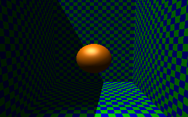

# POV-Ray 3D Modelling Examples

Those are some basics examples to test different types os shapes, light, materials, etc.

## Setup

Just clone the project and open the `.pov` files.  
You need the POV-Ray software installed in your computer.

## Examples

- `01-first.pov` - Differents colors of light.  

- `02-clown.pov` - Sphere (Clown).  

- `03-shapes` - Basics shapes and lights.

- `04-torus-light.pov` - Different types of light in the Torus.  

- `05-light-walls.pov` - Different types of light in the wall.  

- `06-solids-views.pov` - Different types of solids.  

- `07-shadows.pov` - Different types of lights/shadows.  
