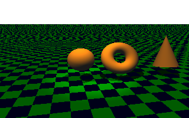
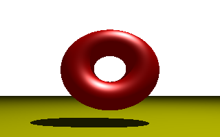

# POV-Ray 3D Modelling Examples

Those are some basics examples to test different types os shapes, light, materials, etc.

## Setup

Just clone the project and open the `.pov` files.  
You need the POV-Ray software installed in your computer.

## Examples

- `0-Inicio.pov` - Differents types of light.  

- `01-Palhaco.pov` - Sphere (Clown).

- `02-Iluminacao Fontes de Luz.pov` - Differents shapes and lights.

- `03-1 - Modelos de Iluminacao.pov` - Different types of light.  
