# POV-Ray 3D Modelling Examples

Those are some basics examples to test different types os shapes, light, materials, etc.

## Setup

Just clone the project and open the `.pov` files.  
You need the POV-Ray software installed in your computer.

## Examples

- `01-first.pov` - Differents colors of light.  
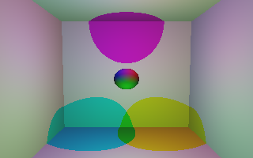

- `02-clown.pov` - Sphere (Clown).  
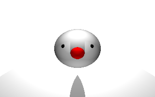

- `03-shapes` - Basics shapes and lights.  
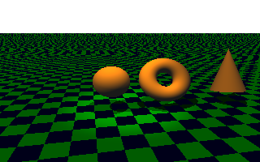

- `04-torus-light.pov` - Different types of light in the Torus.  
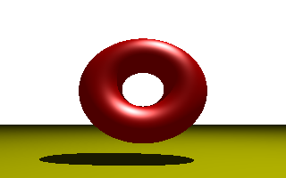

- `05-light-room.pov` - Different types of light inside the room.  
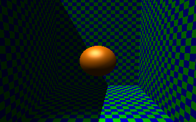

- `06-solids-views.pov` - Different types of solids.  
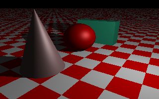

- `07-shadows.pov` - Different types of lights/shadows.  
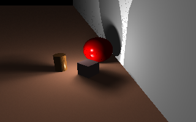

- `04-torus-light.pov` - Different types of light in the Torus.  

- `08-table.pov` - Table.  
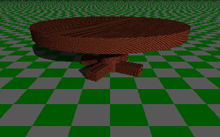

- `09-geometry.pov` - Constructive Solid Geometry.  
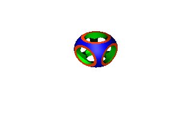

- `10-merge.pov` - Using Merge (Hourglass).  
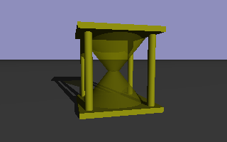

- `11-cup.pov` - Transparency (Cup).  
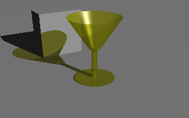

- `12-vase.pov` - SOR - Surface of Revolution (Vase).  
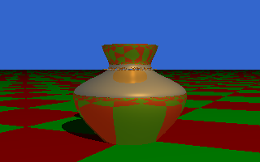

- `13-letters.pov` - Letters.  
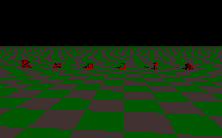

- `14-textures.pov` - Solids with differents textures  
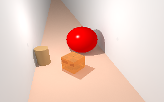

- `15-courtyard.pov` - Quality of the render (Courtyard).  
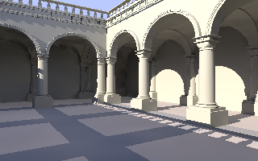